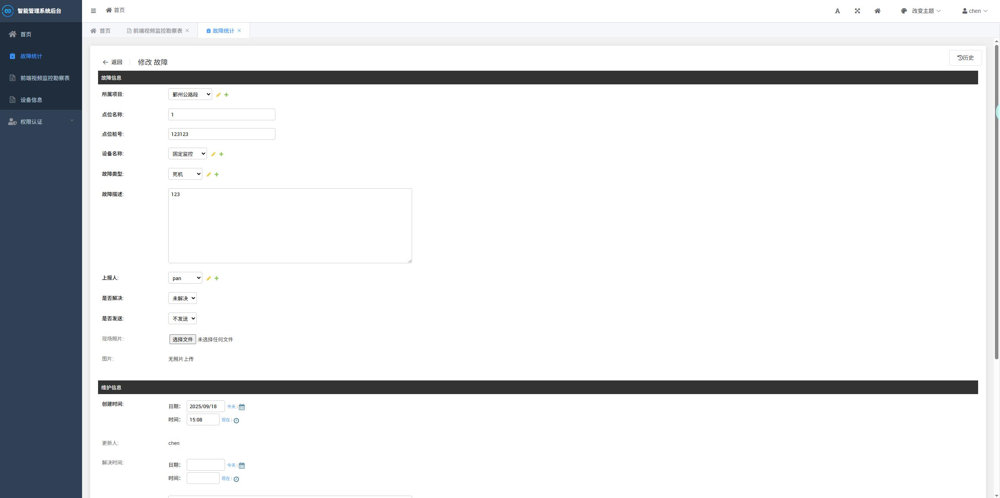

## 开发
```bash
# 克隆项目
git clone https://github.com/chen233/django-device.git

# 安装依赖
pip install -r pip_list.txt
   
# 初始化数据库
python manage.py makemigrations
python manage.py migrate
python manage.py makemigrations

# 启动服务
python manage.py runserver
```
浏览器访问 http://localhost:8000


~~~~~~~



